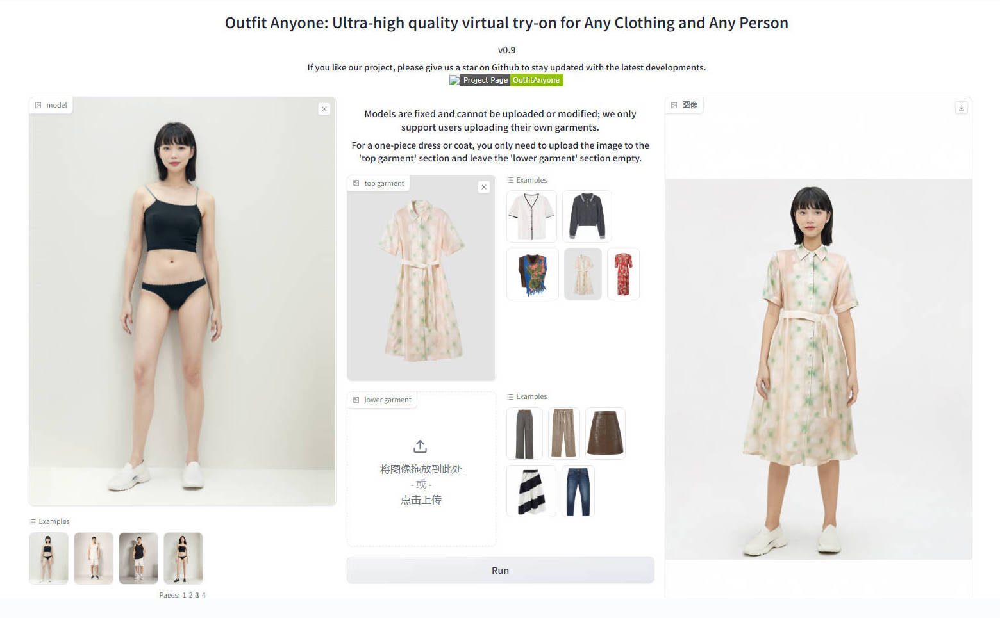
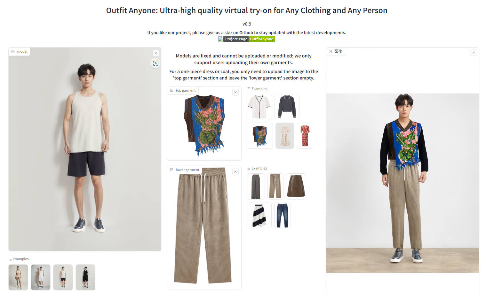
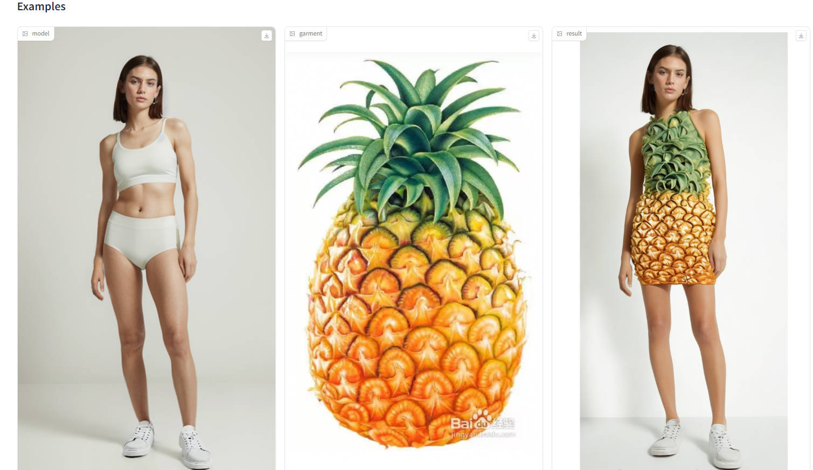

# outfit-anyone
[English](https://github.com/ihmily/outfit-anyone/blob/main/README.md)  | [简体中文](https://github.com/ihmily/outfit-anyone/blob/main/README_CN.md)

Outfit Anyone (Latest Fixed Version): Ultra-high quality virtual try-on for Any Clothing and Any Person


## How to Run

Test Environment:  Python 3.10(ubuntu22.04)

Pull or download the code

```
git clone https://github.com/ihmily/outfit-anyone.git
```

Install dependencies

```
cd outfit-anyone
pip install -r requirements.txt
```

Set up the environment variable

```
export OA_IP_ADDRESS=https://humanaigc-outfitanyone.hf.space/--replicas/ppht9/
```

Run

```
python app.py
```

If the `OA_IP_ADDRESS` becomes invalid, please contact me to update it or visit [OutfitAnyone - a Hugging Face Space by HumanAIGC](https://huggingface.co/spaces/HumanAIGC/OutfitAnyone) to get the updated address.


## View Results









